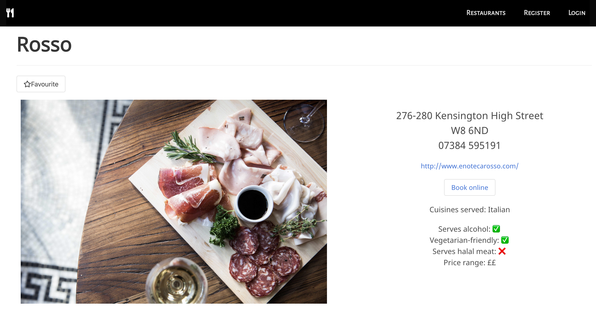
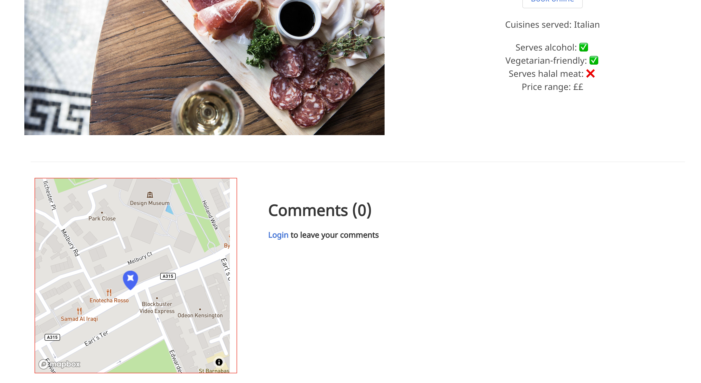
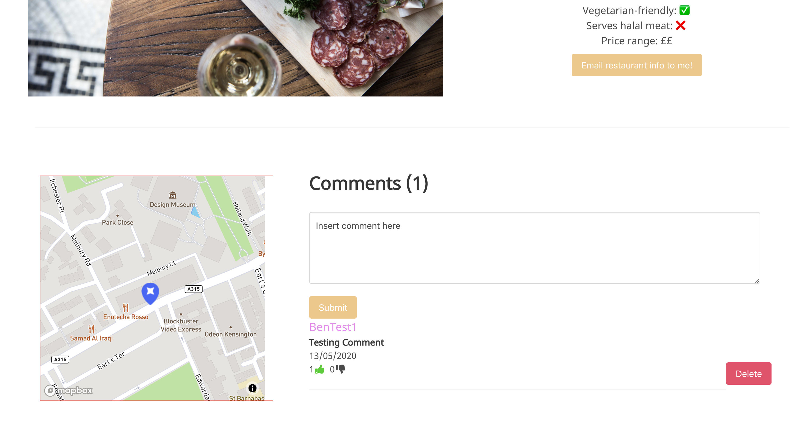
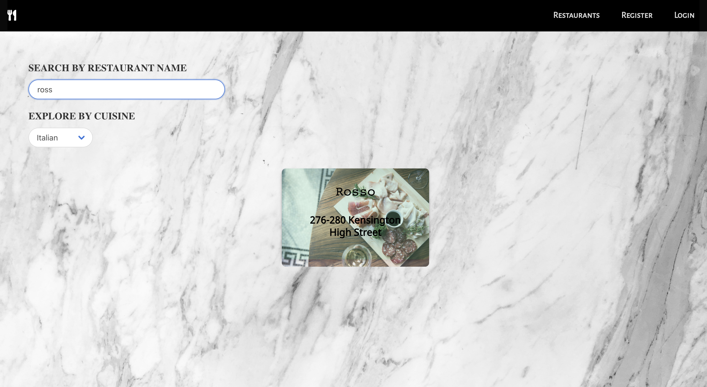

###  General Assembly, Software Engineering Immersive

# Pac Man
by [Ben Harris](https://github.com/benharris8), [Emma Hobday](https://github.com/emmahobday), [Denise Cheung](https://github.com/denisecheung3) and [Subash Limbu](https://github.com/subashlimbu).

## Table of Contents
1. [Overview](#Overview)
2. [Technologies Used](#Technologies-Used)
3. [Implementation](#Implementation)
4. [Screenshots](#Screenshots)
5. [Challenges](#Challenges)
6. [Potential Future Features](#Potential-Future-Features)
7. [Lessons Learned](#Lessons-Learned)


# Overview

This was a 2 week long group project for which we used the MERN stack to create a full stack web application.

Food for Thought is a website where users can browse restaurants in the London area. Furthermore, restaurant owners can add their own restaurants.

# Technologies Used
- MERN Stack
- GridFS
- Bulma

# Implementation
## Backend

MongoDB Models

We designed our MongoDB data models first as it is important to make sure they are designed correctly from the start.

The restaurant model was simple as we just needed to think about what each restaurant would need to display in terms of information for customers. However we decided to add the ability for users to comment on restaurants so we included a comment model too.

```js
const commentSchema = mongoose.Schema({
  text: { type: String, required: true },
  user: { type: mongoose.Schema.ObjectId, ref: 'User', required: true },
  likedBy: [{ type: mongoose.Schema.ObjectId, ref: 'User', required: false }],
  dislikedBy: [{ type: mongoose.Schema.ObjectId, ref: 'User', required: false }] 
}, {
  timestamps: true
});

const restaurantSchema = mongoose.Schema({
  name: { type: String, required: true },
  link: { type: String, required: false },
  address: { type: String, required: true },
  postcode: { type: String, required: true },
  telephone: { type: String, required: true },
  bookingLink: { type: String, required: false },
  cuisine: { type: Array, required: true },
  serveAlcohol: { type: Boolean, required: false },
  veggieFriendly: { type: Boolean, required: false },
  halalFriendly: { type: Boolean, required: false },
  priceRange: { type: Number, required: true },
  user: { type: mongoose.Schema.ObjectId, ref: 'User', required: true },
  comments: [commentSchema],
  image: { type: String, required: false },
  imageGallery: { type: Array, required: false }
});
```

The comments have a list of user id's which can link to the users in the user collection. These lists are used to count the number of likes and dislikes and also to check if the currently logged in user has liked or disliked a comment.

The user model has some built in error handling for if certain fields are missing which are required.
```js
const schema = new mongoose.Schema({
  username: { 
    type: String, 
    required: [true, 'please enter a username'], 
    unique: true 
  },
  email: {
    type: String,
    required: [true, 'please enter an email address'],
    minLength: 8,
    unique: true,
    validate: [isEmail, 'please enter a valid email address']
  },
  password: {
    type: String,
    required: [true, 'please enter a password'],
    hide: true
  },
  favourites: [{ type: mongoose.Schema.ObjectId, ref: 'Restaurant', required: false }]
})
```
The required key can take in an array which tells it both that the field is required (throw and error if it is missing on validation) and the error message which should be sent.

The validate key in the email object also takes an array however the first item is a third party email validation check which we have imported from a validator package. 

MongoDB has life-cycle methods which can be used to write checks and validations to take place whilst data is being validated and then saved.

Firstly mongoose gets the 'password_confirmation' from the data sent from the front end login request and assign it to a variable so it can be accessed at later stages of the password validation process.

```js
schema.
  virtual('passwordConfirmation')
  .set(function setPasswordConfirmation(passwordConfirmation) {
    this._passwordConfirmation = passwordConfirmation
  })
```

Then the password is checked before data validation to see if it passes a password complexity check. This check is imported from a package called joi-password-complexity. If it fails it uses the inbuilt MongoDB invalidate method which invalidates a field and sends back an error message.

If it passes the complexity check then it checks if the password and password_confirmation match and, if that succeeds, it moves on to validation where it checks the fields according to the model.

```js
schema
  .pre('validate', function checkPassword(next) {
    if (this.isModified('password')) {
      const validationResult = passwordComplexity().validate(this.password)
      if (validationResult.error) {
        this.invalidate('password', 'Password must be at least 8 characters long, contain at least 1 uppercase letter, 1 lowercase letter, 1 number and 1 special character.')
      }
      if (this._passwordConfirmation !== this.password) {
        this.invalidate('passwordConfirmation', 'passwords should match')
      }
    }
    next()
  })
```

Finally, if the user passes validation, the password is hashed and salted with bcrypt.
The pre save life-cycle method is used which is just after successful validation but before the data is saved to the collection.

```js
schema
  .pre('save', function hashPassword(next) {
    if (this.isModified('password')) { // If the password has been created or changed
      this.password = bcrypt.hashSync(this.password, bcrypt.genSaltSync()) // Encrypt the password
    }
    next()
  })
```

The last bit of the user model is a validate function which is used whenever a user wants to log on. It hashes a password and checks that hashed password with the stored password for that user, returning true if the passwords are the same.

```js
schema.methods.validatePassword = function validatePassword(password) {
  return bcrypt.compareSync(password, this.password)
}
```

Auth

The userController controls the login/register end-point logic.

Register just takes in a user object as defined in the MongoDB model and tries to save it to the collection, returning any error messages to the front-end. 

```js
function register(req, res) {
  User
    .create(req.body)
    .then(user => {
      res.status(201).send(user)
    })
    .catch(error => {
      res.status(401).send(error)
    })
}
```

The login function finds a user based on the email in the object sent from the front-end and calls the model validate password function. If it returns false a 401 unauthorized code is sent back to the front-end. If it returns true then a JWT token is generated with the username, secret phrase, and an expiration time and is sent to the front-end.

```js
function login(req, res) {
  User
    .findOne({ email: req.body.email })
    .then(user => {
      if (!user || !user.validatePassword(req.body.password)) {
        return res.status(401).send({ message: 'Unauthorized' })
      }
      const token = jwt.sign({ sub: user._id }, secret, { expiresIn: '6h' })
      res.status(202).send({ message: `${user.username}`, token })
    })
    .catch(error => res.send({ errors: error.errors }))
}
```

There are end-points which require a user to be logged in to access. For these ones we first route them through a file called secureRoute.js in the lib folder. This will check the token sent with the request and will either allow the user to carry on or will throw an error back to the front-end.

```js
router.route('/restaurant/:id/comment/:commentId/like')
  .put(secureRoute, restaurantController.likeComment)
```
```js
const User = require('../models/user')
const { secret } = require('../config/environment')
const jwt = require('jsonwebtoken')


function secureRoute(req, res, next) {
  const authToken = req.headers.authorization
  // console.log(authToken)
  if (!authToken || !authToken.startsWith('Bearer')) {
    // if in here that means either no token at all or auth token doesn't start with bearer so bye 
    console.log('failed')
    return res.status(401).send({ message: 'No token provided or token does not start with Bearer! ' })
  }

  // if we get here we have a token that begins with 'Bearer' but don't know if it's definitely valid yet 
  const token = authToken.replace('Bearer ', '')

  // so we use jwt to help us check if the token user trying to give us is valid or not 
  // payload is the name of a section of the token where we added extra stuff like sub (Which is user._id)
  jwt.verify(token, secret, (err, payload) => {
    // If jwt verification fails will throw errow and re send 401 back + unauthorised message 
    if (err) return res.status(401).send({ message: 'Token starts with bearer but token is not valid!' })
    User
      // payload.sub is the user Id we stored on the token in userController when we generated the token for the user
      .findById(payload.sub)
      .then(user => {
        if (!user) return res.status(401).send({ message: 'Unauthorized, no user associated with this ID' })

        // if we get here it means we found user using the user ID and we can pinpoint exactly which user! 

        // Attach our user to our request, so that our routes can access the user
        req.currentUser = user 

        next()   // Finish this middleware, let express know we're done
      })
      .catch(() => res.status(401).send({ message: 'Unauthorized, catch error' }))
  })
}
```

Endpoints

There are basic end-points for getting all of the restaurants and getting a specific restaurant.
There are also end-points for adding restaurants and editing/deleting specific restaurants.

```js
router.route('/restaurants')
  .get(restaurantController.index)
  .post(secureRoute, restaurantController.createNewRestaurant)
```
```js
router.route('/restaurant/:id')
  .get(restaurantController.viewARestaurant)
  .delete(secureRoute, restaurantController.deleteARestaurant)
  .put(secureRoute, restaurantController.editARestaurant) 
```
The comments and their likes/dislikes are also controlled with end-points.

```js
router.route('/restaurant/:id/comments')
  .post(secureRoute, restaurantController.CreateNewComment)
  .get(restaurantController.getComments)

router.route('/restaurant/:id/comment/:commentId')
  .delete(secureRoute, restaurantController.DeleteAComment)
  .put(secureRoute, restaurantController.EditAComment)

router.route('/restaurant/:id/comment/:commentId/like')
  .put(secureRoute, restaurantController.likeComment)

router.route('/restaurant/:id/comment/:commentId/unlike')
  .put(secureRoute, restaurantController.unlikeComment)

router.route('/restaurant/:id/comment/:commentId/dislike')
  .put(secureRoute, restaurantController.dislikeComment)

router.route('/restaurant/:id/comment/:commentId/undislike')
  .put(secureRoute, restaurantController.undislikeComment)

router.route('/restaurant/:id/comment/:commentId/likes')
  .get(secureRoute, restaurantController.getLikeAndDislike)

router.route('/restaurant/:id/comment/:commentId/swaplike')
  .put(secureRoute, restaurantController.swapLike)
```

Like, dislike, unlike and undislike all either add or remove the user from the list of likes/dislikes on a comment. 
Swaplike checks if the user has liked or disliked the comment, removes them from that list and adds them to the other.

```js
function swapLike(req, res) {
  const currentUser = req.currentUser
  Restaurant
    .findById(req.params.id)
    .then(restaurant => {
      if (!restaurant) return res.status(404).send({ error: 'No restaurant found with this ID.' })
      const comment = restaurant.comments.id(req.params.commentId)
      if (comment.dislikedBy.includes(currentUser._id)) {
        comment.dislikedBy.splice(comment.dislikedBy.indexOf(currentUser._id), 1)
        comment.likedBy.push(currentUser._id)
      } else if (comment.likedBy.includes(currentUser._id)) {
        comment.likedBy.splice(comment.likedBy.indexOf(currentUser._id), 1)
        comment.dislikedBy.push(currentUser._id)
      }
      restaurant.save()
      return res.send({
        dislikedBy: comment.dislikedBy,
        likedBy: comment.likedBy
      })
    })
    .catch(err => console.log(err))
}
```

There is also an end-point for serving the images for each restaurant. 
Images are uploaded using GridFS in order to surpass the file-size limit in MongoDB databases by splitting up large files into smaller chunks. This means that when the file is read it needs to be put back together.

```js
router.route('/images')
  .get(restaurantController.getImages)
router.route('/image/:filename')
  .get(restaurantController.getImage)
```
```js
function getImages(req, res) {
  gfs.files.find().toArray((err, files) => {
    res.send({ files: files })
  }) 
}
```
```js
function getImage(req, res) {
  const filename = req.params.filename
  var readstream = gfs.createReadStream({ filename: filename })
  readstream.on('error', function (err) {
    res.send({ error: 'not found' })
  })
  readstream.pipe(res)
}
```

The GridFS upload logic is expained in the code comments underneath.

```js
//get the mongoose connection instance to MongoDB
const connection = mongoose.connection
let gfs;

//initialised grid file system stream with mongoose
connection.once('open', function () {
  gfs = Grid(connection.db, mongoose.mongo)
  gfs.collection('images')
})

// creates a storage format for files being uploaded using gridfs
var storage = new GridFsStorage({
  //url of the mongodb being uploaded to
  url: uri,
  //the file from the request
  file: (req, file) => {
    return new Promise((resolve, reject) => {
      //random name for the file
      crypto.randomBytes(16, (err, buf) => {
        //reject request if error
        if (err) {
          console.log(err)
          return reject(err)
        }
        //set the filename
        const filename = buf.toString('hex') + path.extname(file.originalname)
        //set the file data
        const fileInfo = {
          //set file name into the actual file
          filename: filename,
          //set the collection in mongodb to add file to
          bucketName: 'images'
        }
        //complete promise if the program gets here
        resolve(fileInfo)
      })
    })
  }
})
```

```js
// creates an instance of the GridFsStorage
const upload = multer({ storage })
// uploads an array of images at the key 'image' in the request object then returns a response
expressServer.post('/api/upload', upload.array('image'), (req, res) => {
  res.send({ files: req.files })
})
```

## Frontend

### Restaurants

A request to the restaurants end-point is made with Axios which returns a full list of restaurant objects from the database and saves them into the React state. Link is used from React Router in order to make each card link to a single restaurant page with all of that restaurant's information.
```js
axios.get('/api/restaurants')
  .then((resp) => this.setState({
    restaurants: resp.data,
    filteredRestaurants: resp.data
}))
```
```jsx
<div className="columns is-full-mobile is-multiline is-centered mobile-padding">
  {this.state.filteredRestaurants.map(restaurant => {
    return <Link key={restaurant._id} className="column is-one-quarter-desktop is-one-third-tablet is-full-mobile" to={`/restaurant/${restaurant._id}`}>
      <div className="card">
        <div className="card-image">
          <figure className="image is-4by3">
            
            <div className="card-content">
              <div className="white">{restaurant.name}</div>
              <p className="subtitle">{restaurant.address}</p>
            </div>
          </figure>
        </div>
      </div>
    </Link>
  })}
</div>
```
The restaurants are rendered using Bulma cards with their names appearing when the user hovers over the card. This is done with a CSS ':hover' class.

This page also allows the user to search through the list of restaurants based on their name via text entry and/or their type of cuisine with a drop-down menu. Making both search methods work together proved to be a bit difficult. We had to write handlers for the search bar and the drop-down which checked if the other had been used already. If the other had been used then the already applied filter needed to be reapplied with the new filter.

```js
  handleSearch(event) { 
    this.setState({ searchText: event.target.value.toLowerCase() }) 
    if (!this.state.dropDownOption) { 
      const onlySearched = this.state.restaurants.filter(restaurant => {
        return restaurant.name.toLowerCase().includes(event.target.value.toLowerCase())
      })
      this.setState({ filteredRestaurants: onlySearched })
    } else { 
      const bothUsed = this.state.restaurants.filter(restaurant => {
        return (restaurant.cuisine.includes(this.state.dropDownOption) && restaurant.name.toLowerCase().includes(event.target.value))
      })
      this.setState({ filteredRestaurants: bothUsed })
    }
  }

  handleDropdown(event) { 

    this.setState({ dropDownOption: event.target.value })
    if (!this.state.searchText) { 
      const onlyDropdownSelected = this.state.restaurants.filter(restaurant => {
        return restaurant.cuisine.includes(event.target.value)
      })
      this.setState({ filteredRestaurants: onlyDropdownSelected })
    } else { 
      const bothUsed = this.state.restaurants.filter(restaurant => {
        return (restaurant.cuisine.includes(event.target.value) && restaurant.name.toLowerCase().includes(this.state.searchText))
      })
      this.setState({ filteredRestaurants: bothUsed })
    }

    if (event.target.value === 'Search All') {
      if (!this.state.searchText) {  
        this.setState({ filteredRestaurants: this.state.restaurants })
      } else { 
        const onlySearched = this.state.restaurants.filter(restaurant => {
          return restaurant.name.toLowerCase().includes(this.state.searchText.toLowerCase())
        })
        this.setState({ filteredRestaurants: onlySearched })
      }
    }

  }

```


### Single Restaurant

An Axios request is made with the id of the restaurant taken from the link and the response (the full restaurant data) is saved to state.
The restaurant's images are retrieved with another request to the images end-point.

If the user is logged in then the email button appears and can be clicked to send the restaurant's details to the user's email address. This happens with an Axios request to the email end-point. 

The comments are loaded in with a seperate class React component which makes an api call to the comments end-point and saves the comments into state.
Each comment is checked for if the user has liked or disliked it and the state for that comment is changed accordingly.
The state changes gives the like/dislike buttons the correct CSS classes to change the colors of the buttons based on whether or not the user has liked the comment.

```js
<FontAwesomeIcon id='comment-rating' className={isLiked ? 'liked' : ''} icon={faThumbsUp} onClick={() => this.handleLike()} />
```

When the user clicks like on a comment the state changes to liked and a call to the like end-point is sent which adds the user's id to the comments likedBy list. If the user has already disliked the comment then a call is made to the swap end-point which removes the user id from the dislikes and adds it to the likes. Similarly if the user has already liked the comment and they click it again then a call is made to the unlike end-point which removes them from the liked list.

The same thing happens for the dislikes with a handleDislike() method.

```js
  handleLike() {
    if (auth.isLoggedIn()) {
      const { restaurantId, comment } = this.props
      const { likeCount, dislikeCount } = this.state
      const url = `/api/restaurant/${restaurantId}/comment/${comment._id}/`
      const authConfig = {
        headers: {
          'Authorization': `Bearer ${auth.getToken()}`
        }
      }
      if (this.state.isLiked === true) {
        console.log('unliked')
        Axios.put(url + 'unlike', {}, authConfig)
          .then(res => console.log('ok ', res))
          .catch(err => console.log('err ', err))
        this.setState({
          isLiked: false,
          likeCount: likeCount - 1
        })
      } else if (this.state.isDisliked === true) {
        console.log('liked and undisliked')
        Axios.put(url + 'swaplike', {}, authConfig)
          .then(res => console.log('ok ', res))
          .catch(err => console.log('err ', err))
        this.setState({
          isLiked: true,
          isDisliked: false,
          likeCount: likeCount + 1,
          dislikeCount: dislikeCount - 1
        })
      } else {
        console.log('onlyliked')
        Axios.put(url + 'like', {}, authConfig)
          .then(res => console.log('ok ', res))
          .catch(err => console.log('err ', err))
        this.setState({
          isLiked: true,
          likeCount: likeCount + 1
        })
      }
    }
  }
```

The log in and register pages have forms which, when the form is submitted, will generate an Axios request to the relevant end-point with the data from the form as the payload. If the Axios request returns an error the error is displayed with red text underneath the bad field.


# Screenshots











# Challenges

This was my first time using git with a group of people working on the same project and I found the learning process for creating and merging new branches to be quite difficult.

# Potential Future Features

- Site-wide CSS overhaul to improve user experience.
- User profile picture display in the profile page.

# Lessons Learned

- Spend more time on the design phase to make sure you have the data models correct before moving on to implementation.
- Spend more time designing the overall look of the site before implementing CSS in order to make writing CSS easier.
